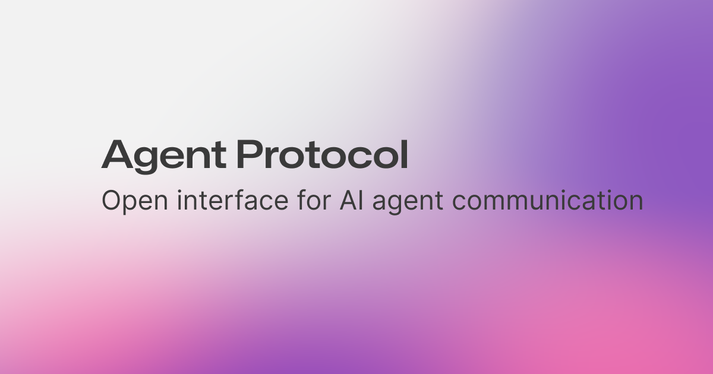

<h1 align="center">
  
</h1>
<p align="center">
  <a href="https://discord.gg/U7KEcGErtQ" target="_blank">
    
  </a>
  <a href="https://twitter.com/e2b_dev" target="_blank">
    
  </a>
</p>

The AI agent space is young. Most developers are building agents in their own way. This creates a challenge:
It's hard to communicate with different agents since the interface is often different every time.
Because we struggle with communicating with different agents, it's also hard to compare them easily.
Additionally, if we had a single communication interface with agents, it'd also make it easier developing devtools that works with agents out of the box.

We present the **Agent Protocol** - a single common interface for communicating with agents.
Any agent developer can implement this protocol.
The Agent Protocol is an API specification - list of endpoints, which the agent
should expose with predefined response models.
The protocol is **tech stack agnostic**. Any agent can adopt this protocol no
matter what framework they're using (or not using).

We believe, this will help the ecosystem grow faster and simplify the integrations.

We're starting with a minimal core. We want to build upon that iteratively
by learning from agent developers about what they actually need.

## The incentives to adopt the protocol

- Ease with which you can use the benchmarks.
- Other people can more easily use and integrate your agent
- Enable building general devtools (for development, deployment and monitoring)
  that can be built on top of this protocol
- You don’t need to write boilerplate API and you can focus on developing your
  agent

## 🎯 Immediate goals of the protocol

Set a general simple standard that would allow for easy to use benchmarking of
agents. One of the primary goals of the protocol is great developer experience,
and simple implementation on the end of agent developers. You just start your
agent and that’s all you have to do.

## 🗣️ Request for Comments

If you'd like to propose a change or an improvement to the protocol. Please
follow the [RFC template](./rfcs/template.md).

## ⚙️ Components

### [Protocol](./openapi.yml)

The most important part. It specifies which endpoints should the agent expose.
The protocol is defined in [OpenAPI specification](./openapi.yml).

#### How does the protocol work?

Right now the protocol is defined as a REST API (via the
[OpenAPI spec](./openapi.yml)) with two essential routes for interaction with
your agent:

- `POST /agent/tasks` for creating a new task for the agent (for example giving
  the agent an objective that you want to accomplish)
- `POST /agent/tasks/{task_id}/steps` for executing one step of the defined task

It has also a few additional routes for listing the tasks, steps and downloading / uploading artifacts.

### [SDK](./sdk)

This is our implementation of the protocol. It’s a library that you can use to build your agent. You can use it, or you can implement it on your own. It’s up to you.

Using the SDK should simplify the implementation of the protocol to the bare minimum, but at
the same time it shouldn't tie your hands. The goal should be to allow agent
builders to build their agents and the SDK should solve the rest.

Basically it wraps your agent in a web server that allows for communication with
your agent (and in between agents in the future).

### [Client](./client)

This library should be used by the users of the agents. Your agent is deployed somewhere and the users of your agent can use this library to interact with your agent.

Thanks to the standard the users
can try multiple agents without the need for any additional adjustments (or very
minimal) in their code.

## 📦 Usage (protocol)

If you want to use the protocol in your project, you can use the SDK or you can implement it on your own. You should follow the [OpenAPI specification](./openapi.yml) and implement the endpoints defined there. You can add additional endpoints if you need to.

## 👩‍💻 Usage (builders)

### Python SDK

You can find the full example
[in the Python SDK directory](sdk/python/README.md)

### JavaScript/TypeScript SDK

You can find the full example [in the JS/TS SDK directory](sdk/js/README.md)

### Test compliance with the protocol

You can test your agent's compliance with the protocol by installing the python
package:

```sh
pip install agent-protocol
```

and then running the following command:

```sh
agent-protocol test --url <your-agent-url>
```

#### Validator as a part of CI Pipeline

We advise you to add the validator as a part of your CI pipeline. It’s very
minimal and the setup is simple.

```yaml
jobs:
  publish:
    name: Validate agent protocol compliance
    runs-on: ubuntu-20.04
    steps:
      - name: Checkout repository
        uses: actions/checkout@v3

      - name: Set up Python
        uses: actions/setup-python@v4
        with:
          python-version: '3.10'

      - name: Install agent protocol
        run: pip install agent-protocol

      - name: Run agent
        run: <command to run your agent>

      - name: Validate agent protocol compliance
        run: agent-protocol test --url <your-agent-url>
```

You can then add a badge to your agent to show it is agent protocol compliant.

```markdown

```

## 👩‍💻 Usage (Clients)

This section shows how you can easily interact with the agent compliant with the
agent protocol.

### Client SDK

- [Python](client/python/README.md#getting-started)
- JavaScript SDK is not done yet.

### Python without SDK

```python
import requests

url = "http://localhost:8000"

# Create task
response = requests.post(f"{url}/agent/tasks", json={"input": "task-input-to-your-agent"})
task_id = response.json()["task_id"]

# Execute steps until the completion
while (step := requests.post(f"{url}/agent/tasks/{task_id}/steps")) and not step.json()['is_last']:
    print("Interim output:", step.json()["output"])

# Print output
print("Done!", step.json()["output"])
```

### JS without SDK

```JavaScript
const url = "http://localhost:8000";
const body = JSON.stringify({ input: "task-input-to-your-agent" });

// Create task
let response = await fetch(`${url}/agent/tasks`, { method: "POST" }, { body });
let data = await response.json();

const taskId = data.task_id;
let isLast = false;

// Execute steps until the completion
while (!isLast) {
  response = await fetch(`${url}/agent/tasks/${taskId}/steps`, {
    method: "POST",
  });
  data = await response.json();
  isLast = data.is_last;
}

// Print output
console.log("Done!", data.output);
```

### cURL

To **create a task** run:

```sh
curl --request POST \
  --url http://localhost:8000/agent/tasks \
  --header 'Content-Type: application/json' \
  --data '{
	"input": "task-input-to-your-agent"
}'
```

You will get a response like this:

```json
{
  "input": "task-input-to-your-agent",
  "task_id": "e6d768bb-4c50-4007-9853-aeffb46c77be",
  "artifacts": []
}
```

Then to **execute one step of the task** copy the `task_id` you got from the
previous request and run:

```sh
curl --request POST \
  --url http://localhost:8000/agent/tasks/<task-id>/steps
```

To get response like this:

```json
{
  "output": "output-from-the-agent",
  "artifacts": [],
  "is_last": false,
  "input": null,
  "task_id": "e6d768bb-4c50-4007-9853-aeffb46c77be",
  "step_id": "8ff8ba39-2c3e-4246-8086-fbd2a897240b"
}
```

## 🤗 Adoption

### Engaged projects in development of agent protocol

- [e2b](https://e2b.dev)
- [Auto-GPT](https://news.agpt.co/)

### Open-source agents and projects that have adopted Agent Protocol

- ✅ [Auto-GPT](https://github.com/Significant-Gravitas/Auto-GPT)
  - Track [PR here](https://github.com/Significant-Gravitas/Auto-GPT/pull/5044)
- 🚧 [Auto-GPT-Forge](https://github.com/Significant-Gravitas/Auto-GPT-Forge)
- 🚧
  [Auto-GPT-Benchmarks](https://github.com/Significant-Gravitas/Auto-GPT-Benchmarks)
  - Track
    [PR here](https://github.com/Significant-Gravitas/Auto-GPT-Benchmarks/pull/209).
    Waiting for merge.
- 🚧 [babyagi](https://github.com/yoheinakajima/babyagi)
  - Track [PR here](https://github.com/yoheinakajima/babyagi/pull/356). Waiting
    for merge.
- ✅ [smol developer](https://github.com/smol-ai/developer)
  - Track [PR here](https://github.com/smol-ai/developer/pull/123).
- 🚧 [beebot](https://github.com/AutoPackAI/beebot)
  - Might require more features. See
    [issue here](https://github.com/e2b-dev/agent-protocol/issues/9).

## 📃 High-level future roadmap

- Agent-to-agent communication
- Connection to the outside world:
  - 3rd party services (= “Agent I/O”)
  - Authentication on behalf of users
- Is there anything missing? Please submit an RFC with a proposed feature!

### Creating your own SDK that implements the protocol

The protocol is described in the OpenAPI spec in
[this file](https://github.com/e2b-dev/agent-protocol/blob/main/openapi.yml).
You can create your own SDK that implements this protocol just by implementing
the spec.

We tried for the current implementations to be fairly simple (please let us know
if you think this isn't true). You can get inspired by looking in a source code
of the official
[Python SDK](https://github.com/e2b-dev/agent-protocol/tree/main/agent/python/agent_protocol).

> We plan to add a GraphQL support in the future.

## 💬 Public discourse & development

- PRs and issues are welcome!
- Join [Auto-GPT Discord](https://discord.gg/autogpt) and their dedicated
  `agent-protocol` channel
- Join [e2b Discord](https://discord.gg/U7KEcGErtQ) and their dedicated
  `agent-protocol` channel
